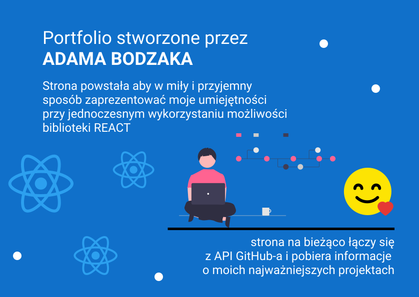

# Strona internetowa stworzona w ramach projektu moje portfolio. Celem projektu było wykorzystanie umiejętności i ugruntowanie wiedzy którą zdobyłem podczas realizacji szeregu kursów i szkoleń, a jednocześnie w miły i przyjemny sposób zaprezentować moje kompetencje.

### Strona na bieżąco łączy się z API GitHub-a i pobiera informacje o moich najważniejszych projektach. W ramach projektu strona została opublikowana z wykorzystaniem GitHub Pages.

---

Umiejętności i technologie które pozwoliły mi zbudować tą stronę to:

1. komponenty funkcyjne.
2. JSX (syntactic sugar).
3. props-y i przekazywanie danych z rodzica do dziecka i z powrotem.
4. komponenty class-owe.
5. stan komponentu i jego modyfikacja.
6. React Router wraz z funkcją Switch.
7. NavLink i jego funkcje.
8. Fetch API.
9. Deployment aplikacji na serwer na GitHub.
10. Stopkę która będzie zawierała informacje kontaktowe
11. Wzbogaciłem komponent Header o losowe suchary wystawiane przez zewnętrzne API
12. Dodałem przycisk do losowanie następnego suchara

**Pamiętajmy że ciągle się uczę, a umiejętności wymienione powyżej nie są wszystkimi jakie posiadam. W celu uszczegółowienia zapraszam na [stronę internetową do działu Umiejętności](https://adambodzak.github.io/)**

---

Do strony dodał bym:

1. wersję dark mode.
2. wersję w języku angielskim.
